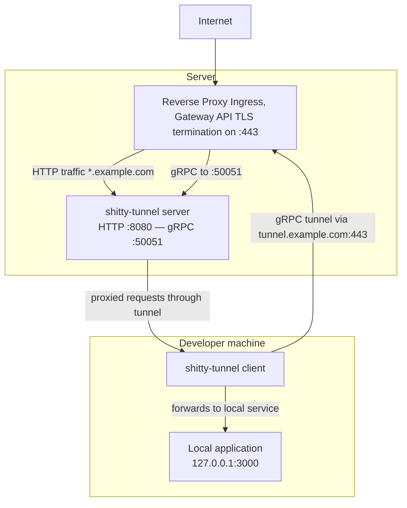

# shittyTunnel

[](https://github.com/agreco/shittyTunnel/releases)
[](https://github.com/agreco/shittyTunnel/pkgs/container/shittytunnel)
[](LICENSE)

A self-hosted tunnel for exposing local services to the internet.

## Features

- **Ed25519 mutual authentication** with timestamp anti-replay (WireGuard-style)
- **gRPC bidirectional streaming** - works behind any HTTP/2-capable ingress, no TCP passthrough needed
- **Auto-reconnect** with exponential backoff
- **Optional basic auth** on forwarded requests
- **Header manipulation** — inject or strip headers on proxied requests and responses
- **Docker** multi-arch images (amd64/arm64) on ghcr.io
- **Cross-platform** binaries for Linux, macOS, and Windows

## How it works



The **server** exposes two ports: one for public HTTP traffic (proxied by your reverse proxy) and one for gRPC tunnel connections from clients. The **client** opens a persistent gRPC stream to the server, receives incoming HTTP requests through it, forwards them to a local service, and sends responses back.

## Disclaimer

This project was born out of personal frustration with paid tunnel services. It was written almost entirely by an LLM, with human guidance on architecture and prompts. After several iterations, It seems to work. That said, you may find no a enterprise-grade, production-ready code here. Use at your own risk, and please contribute improvements if you can!

## Quick start

### 1. Generate keys

Each side (server and client) needs its own Ed25519 keypair. Generate them with:

```bash
shitty-tunnel keygen   # run twice: once for server, once for client
```

Output:
```
Private key: axjhCqieuY3cU6qpRA48FSjKlojaH5+Q5kjm5aLwdfc=
Public key:  P1j5jRykDgudgNJNnrJVXHx85W3koAapuyCnCKcq8XM=
```

Exchange **public** keys out-of-band. Private keys never leave their machine.

### 2. Configure the server

Create `/etc/shittyTunnel/server.toml`:

```toml
[server]
public_port = 8080
tunnel_port = 50051
private_key = "SERVER_PRIVATE_KEY"

# Environment variable expansion is supported:
# private_key = "${SERVER_PRIVATE_KEY}"

[[peers]]
public_key = "CLIENT_PUBLIC_KEY"
domain = "dev1.example.com"
```

### 3. Configure the client

Create `~/.config/shittyTunnel.toml`:

```toml
[client]
server_host = "https://tunnel.example.com"
private_key = "CLIENT_PRIVATE_KEY"
server_public_key = "SERVER_PUBLIC_KEY"

[local]
host = "127.0.0.1"
port = 3000

# Optional: protect the tunnel with basic auth
# basic_auth = "user:password"

# Optional: inject headers on every proxied request and response
# [local.add_headers]
# "X-Forwarded-By" = "shittyTunnel"

# Optional: strip headers from every proxied request and response
# [local.remove_headers]
# names = ["Authorization", "Cookie"]

[reconnect]
enabled = true
initial_delay_ms = 1000
max_delay_ms = 30000
```

### 4. Run

```bash
# Server
shitty-tunnel server --config /etc/shittyTunnel/server.toml

# Client
shitty-tunnel client --config ~/.config/shittyTunnel.toml
```

### 5. Test

```bash
curl -H "Host: dev1.example.com" http://localhost:8080/
```

## Installation

### Pre-built binaries

Download from [GitHub Releases](https://github.com/AttilioGreco/shitty-tunnel/releases).

### Docker

```bash
docker pull ghcr.io/attiliogreco/shitty-tunnel:latest

docker run -d \
  -p 8080:8080 -p 50051:50051 \
  -v ./server.toml:/etc/shittyTunnel/server.toml:ro \
  ghcr.io/attiliogreco/shitty-tunnel:latest \
  server --config /etc/shittyTunnel/server.toml
```

### Build from source

Requires Rust 1.85+ and protobuf compiler (`protoc`).

```bash
git clone https://github.com/agreco/shittyTunnel.git
cd shittyTunnel

# Build and install (requires just: cargo install just)
just install
```

Or manually:

```bash
cargo build --release
sudo install -m 755 target/release/shitty-tunnel /usr/local/bin/shitty-tunnel
```

## Running with systemd

### Server (system service)

Create `/etc/systemd/system/shitty-tunnel-server.service`:

```ini
[Unit]
Description=shittyTunnel Server
After=network-online.target
Wants=network-online.target

[Service]
Type=simple
ExecStart=/usr/local/bin/shitty-tunnel server --config /etc/shittyTunnel/server.toml
Restart=on-failure
RestartSec=5
# Security hardening
NoNewPrivileges=true
ProtectSystem=strict
ProtectHome=true
ReadOnlyPaths=/etc/shittyTunnel

[Install]
WantedBy=multi-user.target
```

Enable and start:

```bash
sudo systemctl daemon-reload
sudo systemctl enable --now shitty-tunnel-server
sudo journalctl -u shitty-tunnel-server -f
```

### Client (user service)

The client runs as a regular user with `systemd --user`.

Create `~/.config/systemd/user/shitty-tunnel-client.service`:

```ini
[Unit]
Description=shittyTunnel Client
After=network-online.target
Wants=network-online.target

[Service]
Type=simple
ExecStart=/usr/local/bin/shitty-tunnel client --config %h/.config/shittyTunnel.toml
Restart=on-failure
RestartSec=5
Environment=RUST_LOG=info

[Install]
WantedBy=default.target
```

Enable and start:

```bash
systemctl --user daemon-reload
systemctl --user enable --now shitty-tunnel-client
journalctl --user -u shitty-tunnel-client -f
```

To keep the user service running after logout:

```bash
loginctl enable-linger $USER
```

You can also use `just` shortcuts:

```bash
just install-systemd-server   # install server unit (requires sudo)
just install-systemd-client   # install client user unit
```

## Task runner

This project uses [just](https://github.com/casey/just) as a task runner. Run `just` to see all available tasks.

| Command | Description |
|---|---|
| `just build` | Build debug binary |
| `just release` | Build release binary |
| `just test` | Run all workspace tests |
| `just install` | Build release and install to `/usr/local/bin` |
| `just install-systemd-server` | Install server systemd unit |
| `just install-systemd-client` | Install client systemd user unit |
| `just up` / `just down` | Start/stop Docker Compose dev environment |
| `just logs` | Follow Docker Compose logs |
| `just release-create VERSION` | Create a new release (tag + push) |

## Header manipulation

The client can inject or strip HTTP headers on every proxied request (sent to the local service) and on every response (returned to the original caller). Rules are applied in this order:

1. Headers listed in `remove_headers` are stripped
2. Headers listed in `add_headers` are injected — overwriting any existing header with the same name

Both sections are optional. If omitted, headers are forwarded as-is (hop-by-hop headers are always stripped regardless).

```toml
[local]
host = "127.0.0.1"
port = 3000

# Inject (or overwrite) these headers on every request and response
[local.add_headers]
"X-Forwarded-By" = "shittyTunnel"
"X-Environment"  = "production"

# Strip these headers from every request and response (case-insensitive)
[local.remove_headers]
names = ["Authorization", "Cookie", "X-Internal-Secret"]
```

**Use cases:**

| Goal | Config |
|---|---|
| Tag requests with a custom header | `[local.add_headers]` |
| Prevent credentials from reaching the local service | `[local.remove_headers]` |
| Override a response header before it reaches the caller | `[local.add_headers]` |
| Strip sensitive response headers (e.g. `Server`, `X-Powered-By`) | `[local.remove_headers]` |

## Further reading

- [Configuration examples](examples/)
- [Kubernetes deployment](examples/kubernetes/)
- [Release scripts](scripts/)

## Security

- **Ed25519 signatures** for mutual authentication
- **Timestamp-based anti-replay** (30-second window)
- **Trivy vulnerability scanning** in CI

## License

Licensed under either of:

- Apache License, Version 2.0 ([LICENSE-APACHE](LICENSE-APACHE))
- MIT license ([LICENSE-MIT](LICENSE-MIT))

at your option.

## Contributing

Contributions are welcome! Feel free to submit a Pull Request.


