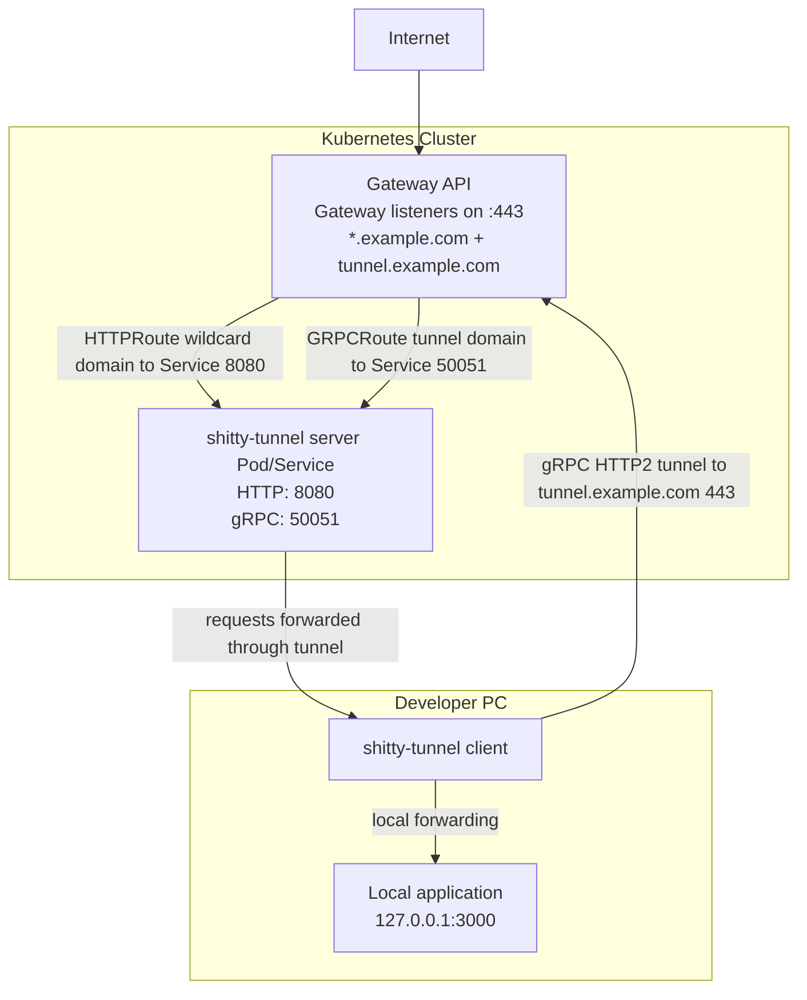

# shittyTunnel - Configuration Examples

This directory contains example configurations to try shittyTunnel locally.

## Quick Setup (local test)

### 1. Generate keys

# Generate keys for the server
```
shitty-tunnel keygen
```
### Output:
```
Private key: axjhCqieuY3cU6qpRA48FSjKlojaH5+Q5kjm5aLwdfc=
Public key:  P1j5jRykDgudgNJNnrJVXHx85W3koAapuyCnCKcq8XM=
```

### Generate keys for the client
```
shitty-tunnel keygen
```
Output:
```
Private key: PATS7QnQDLMGDez8EDi0YCvVx1zjWs1nSu3HjFZ3Fg=
Public key:  ZlsOtT/650gpT8XrPzNJOT4yyuJoYfngRnbRBBHknYE=
```

### 2. Configure the server

Create `/etc/shittyTunnel/server.toml` (or copy `examples/server.toml`):

```toml
[server]
public_port = 8080
tunnel_port = 8443
private_key = "SERVER_PRIVATE_KEY"

[[peers]]
public_key = "CLIENT_PUBLIC_KEY"
domain = "dev1.example.com"
```

**Important:**
- `server.private_key` = private key generated for the server
- `peers[].public_key` = **public** key of the client (out-of-band exchange)

### 3. Configure the client

Create `~/.config/shittyTunnel.toml` (or copy `examples/client.toml`):

```toml
[client]
server_host = "localhost"  # or server IP/hostname
server_port = 8443
private_key = "CLIENT_PRIVATE_KEY"
server_public_key = "SERVER_PUBLIC_KEY"

[local]
host = "127.0.0.1"
port = 3000  # port of your local service
```

**Important:**
- `client.private_key` = private key generated for the client
- `client.server_public_key` = **public** key of the server (out-of-band exchange)

### 4. Start a local service (test)

```bash
# Example with Python
cd /tmp && python3 -m http.server 3000
```

### 5. Start the server

```bash
shitty-tunnel server --config /etc/shittyTunnel/server.toml
# Output:
# INFO loaded config from /etc/shittyTunnel/server.toml
# INFO registered 1 peers
# INFO public HTTP listening on 0.0.0.0:8080
# INFO gRPC tunnel listening on 0.0.0.0:8443
```

### 6. Start the client

```bash
shitty-tunnel client --config ~/.config/shittyTunnel.toml
# Output:
# INFO connecting to localhost:8443
# INFO connected to localhost:8443
# INFO authenticated, tunnel active for dev1.example.com
# INFO forwarding to 127.0.0.1:3000
```

### 7. Test the tunnel

```bash
# HTTP request to server on public port
curl -H "Host: dev1.example.com" http://localhost:8080/

# Server forwards to client, which forwards to localhost:3000
# You should see the response from your local service
```

---

## Production Setup

### Architecture


